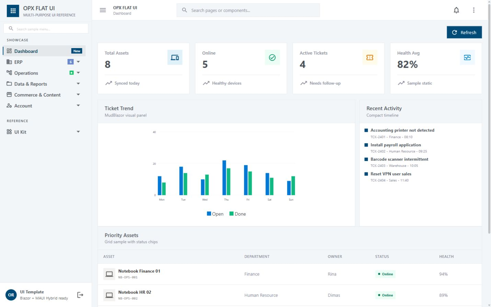
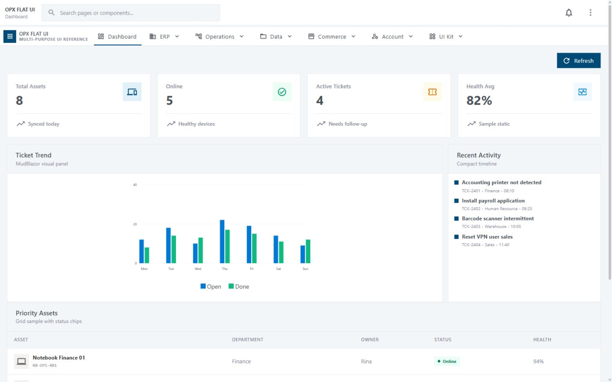
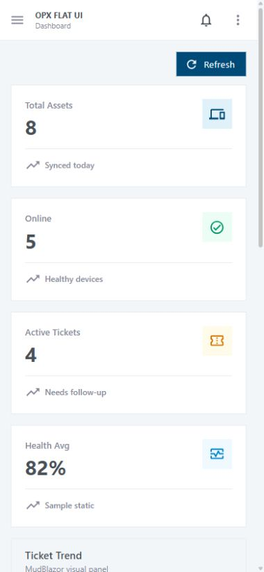
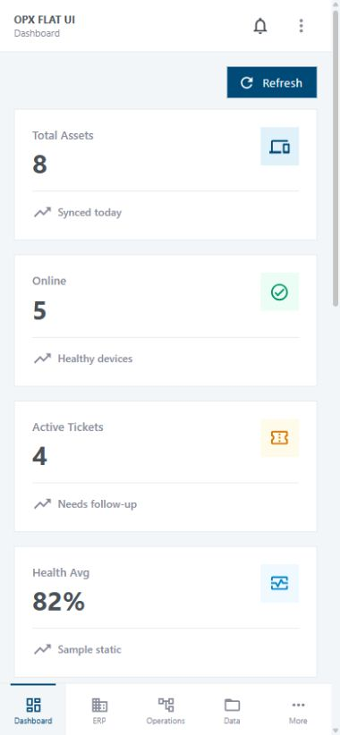
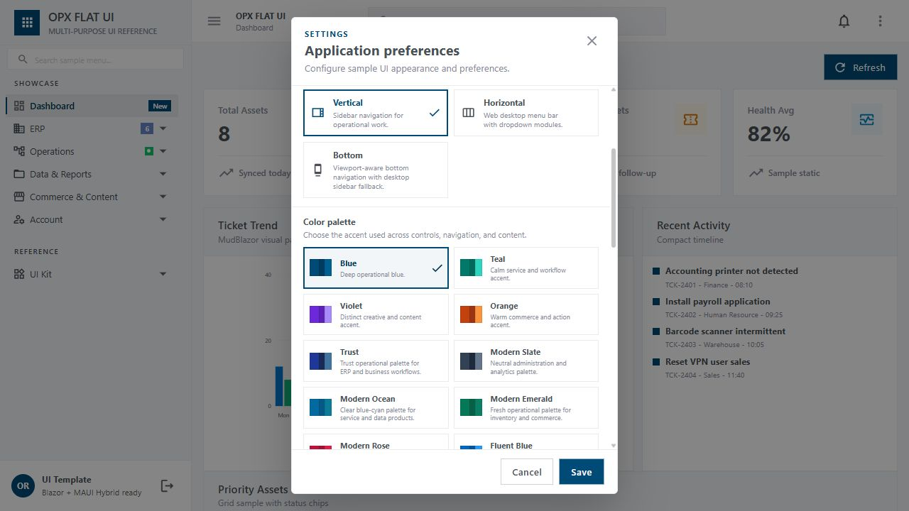

# OPX MudBlazor Flat UI

[](https://www.nuget.org/packages/Opx.MudBlazor.FlatUi/2.0.20)


OPX Flat UI is a NuGet-first UI reference and project template for responsive Blazor Web and .NET MAUI Blazor Hybrid applications. It combines reusable flat operational components, canonical application composition, responsive navigation, theme-aware behavior, and auditable consumer rules.

**Web ready. MAUI Hybrid ready by contract. Powered by [MudBlazor](https://www.mudblazor.com/).**

The reusable component API and original CSS are delivered by [`Opx.MudBlazor.FlatUi`](https://www.nuget.org/packages/Opx.MudBlazor.FlatUi/2.0.20). This repository owns the canonical consumer composition, sample pages, project template, rules, skills, documentation, and validation gates.

## Web preview

### Vertical navigation

Vertical is the default operational layout. It provides a searchable grouped sidebar, route-aware expansion, status badges, the mandatory Settings entry, and a right-aligned Logout action.



### Horizontal navigation

Horizontal is optimized for desktop Web. It moves the product identity and module navigation into a compact menu bar while retaining the same routes, permissions, theme, and page state.



## Mobile preview

The mobile composition is responsive, touch-aware, safe-area ready, and designed for both mobile Web and MAUI Blazor Hybrid. Tables can become equivalent cards, dialogs become full-screen editors, and controls retain usable touch geometry.

<table>
  <thead>
    <tr>
      <th>Responsive mobile view</th>
      <th>Phone Bottom bar</th>
    </tr>
  </thead>
  <tbody>
    <tr>
      <td></td>
      <td></td>
    </tr>
  </tbody>
</table>

Bottom navigation reuses the same route tree as the other layouts and is selected from viewport width alone. The package default threshold is `600px`; this template explicitly uses `900px`, so tablet and phone widths receive the bottom bar while wider Web and Windows desktop windows receive the sidebar. It supports up to five root actions, a More entry for overflow, recursive child navigation, and safe-area spacing. Child and overflow navigation defaults to the package Bottom Sheet; the in-content `MainView` tile presentation is explicit opt-in.

Package `2.0.20` keeps labels such as **Settings** fully readable by using a descender-safe `1.25` line-height plus a `1px` bottom inset. Single-line ellipsis and the `60px` bar height remain unchanged; consumer CSS does not override this package-owned geometry.

## Application Settings

Every initialized consumer keeps **Settings → Application preferences** in the AppBar overflow menu. The surface previews changes immediately, persists them only after **Save**, restores the current saved state on **Cancel**, and returns to host-configured defaults through **Restore application defaults**.



The canonical Settings surface provides:

- **Theme:** Light (default), Dark / Night, or Auto following the device preference.
- **Navigation:** Vertical, Horizontal, or viewport-aware Bottom navigation; Bottom child menus can use a sheet or the main content view.
- **Color system:** built-in operational palettes plus separate validated sidebar background/foreground colors for Light and Dark.
- **Density and fields:** spacing defaults to the package `Default` density preset; Compact and Comfortable remain selectable, alongside the supported input presentation style.
- **Typography:** Device ownership by default, or a bounded Manual font-size preference.
- **Surface behavior:** backdrop opacity and controlled corner radius.
- **Recovery:** live preview, Cancel rollback, Save persistence, and restoration to `appsettings.json` defaults.
- **Host extension:** local OS/device notification preferences remain owned by the Web or MAUI host, including permission and scheduling.

The source defaults live under `OpxFlatUi:Display` in `appsettings.json`, including the canonical `DefaultRoundedSizePx: 7` for ordinary buttons and bottom-sheet top corners. Other standard surfaces remain square, and consumers must not reproduce this package-owned geometry with local CSS. Real per-user storage, authorization, cross-device synchronization, notification delivery, and administrative policy remain consumer responsibilities.

## OPX components beyond MudBlazor

MudBlazor remains the underlying visual component library. `Opx.MudBlazor.FlatUi` adds higher-level operational components and application contracts so consumers do not have to reconstruct responsive shells, workflows, editors, and enterprise states from individual controls.

| Capability | Principal OPX components |
|---|---|
| Application shell and navigation | `FlatAppShell`, `FlatHorizontalNavigation`, `FlatDynamicMenu`, `FlatNavigationBadge`, `FlatPage`, `FlatPanel`, `FlatFab` |
| Theme, startup, and system feedback | `FlatMudProviders`, `FlatDisplaySettings`, `FlatSessionRestore`, `FlatReconnectModal`, `FlatProcessingContainer`, `FlatMessageBoxDialog`, `FlatUnsavedChangesGuard`, `FlatDeviceNotification` |
| Dashboard and status widgets | `FlatWidget`, `FlatMetricWidget`, `FlatActionMetricWidget`, `FlatProgressWidget`, `FlatSegmentProgressWidget`, `FlatCompactMetric`, `FlatStatCard`, `FlatStatusChip`, `FlatActivityItem`, `FlatTaskItem`, `FlatTimeline` |
| Data grids and hierarchy | `FlatDataGrid`, `FlatMobileGrid`, `FlatGroupedDataGrid`, `FlatEditableGrid`, `FlatAdvancedEditableGrid`, `FlatTreeGrid`, `FlatPager`, `FlatGridPreferencesPanel`, `FlatHierarchyDesigner` |
| CRUD, forms, lookup, and input | `FlatModelCrud`, `FlatSchemaForm`, `FlatModelFormDesigner`, `FlatFormModal`, `FlatEditorWorkspace`, `FlatEntityLookup`, `FlatSearchComboBox`, `FlatMultiSelect`, `FlatNumberInput`, `FlatMoneyInput`, `FlatQuantityInput`, `FlatMaterialIconPicker` |
| Files, images, and documents | `FlatFileUpload`, `FlatImageUpload`, `FlatDataImport`, `FlatDocumentWorkspace`, `FlatDocumentAttachmentManager`, `FlatPdfViewer`, `FlatPrintLayout` |
| Reports and analytics | `FlatOperationalReportViewer`, `FlatPivotGrid`, `FlatPivotFieldChooser`, `FlatDataComparisonGrid`, `FlatQueryBuilder` |
| Scheduling and planning | `FlatCalendar`, `FlatScheduler`, `FlatRecurrenceEditor`, `FlatKanbanBoard`, `FlatPlanningBoard`, `FlatDashboardComposer` |
| Transactions, ERP, and operations | `FlatTransactionWorkspace`, `FlatEditableGrid`, `FlatRecordLifecycleHeader`, `FlatJournalEntryGrid`, `FlatReconciliationWorkspace`, `FlatInventoryAllocationWorkspace`, `FlatInventoryTraceabilityWorkspace`, `FlatBomRoutingEditor`, `FlatMrpCapacityWorkspace`, `FlatIntegrationCenter`, `FlatBackgroundOperationCenter` |
| Workflow and governance | `FlatWorkflowPanel`, `FlatWorkflowDesigner`, `FlatApprovalInbox`, `FlatApprovalMatrixDesigner`, `FlatRuleBuilder`, `FlatBulkActionBar`, `FlatAuditTrail`, `FlatGovernancePanel` |
| Communication and collaboration | `FlatChatShell`, `FlatChatMessage`, `FlatEmailShell`, `FlatCollaborationPanel`, `FlatConflictResolver`, `FlatNotificationCenter` |
| Content, commerce, and profile | `FlatProductDetail`, `FlatCatalogGrid`, `FlatCatalogCard`, `FlatJobCard`, `FlatProfileCard`, `FlatProfileAvatar`, `FlatDetailSection`, `FlatInfoItem`, `FlatEmptyState` |
| Spatial UI | `FlatVectorMap`, `FlatSpatialWorkspace` and their typed region, route, marker, layer, and geofence models |
| Application experience | `FlatCommandPalette`, `FlatAccessibilitySettings`, `FlatPermissionView`, `FlatFeatureView`, `FlatMasterDetailWorkspace`, `FlatOfflineSyncPanel` |

The OPX components own presentation, responsive composition, interaction state, and typed intent. APIs, database access, business calculations, authorization, transaction commits, file storage, notifications, realtime transport, and audit persistence stay host-owned.

## Special features

- **Three responsive navigation modes** — Vertical sidebar, Horizontal desktop menu, and viewport-aware Bottom navigation from one route tree.
- **Adaptive data presentation** — `FlatDataGrid` desktop tables and equivalent tablet/mobile cards preserve one query, filter, sort, paging, selection, permission, and loading state.
- **Operational dashboards** — compact KPI widgets, charts, activity feeds, status chips, summary lists, quick actions, and responsive panel composition.
- **CRUD and transaction workspaces** — responsive editor shells, full-screen mobile forms, dirty-state protection, entity lookup, bulk actions, approval flows, and host-owned persistence boundaries.
- **Advanced reusable surfaces** — Pivot, Kanban, Chat, Email, command palette, schema-driven forms, editable grids, audit trail, collaboration, conflict resolution, document workspaces, import, calendar, and notification samples.
- **Theme and display preferences** — Light theme with Fluent Blue default palette, Dark / Night, Auto, multiple palettes, density presets, Device or Manual typography, configurable backdrop, and controlled corner sizing.
- **Shared loading system** — responsive initial skeletons, AppBar operation progress, `FlatReconnectModal`, and the mandatory MAUI `Memuat` spinner using the same package-owned visual.
- **Secure startup presentation** — `FlatSessionRestore` blocks protected UI while the host validates an untrusted saved-session hint. Local storage is never the authorization authority.
- **MAUI system integration contract** — AppBar-synchronized Android/iOS status bar, Device typography, accessibility-scaled text buttons, safe areas, lifecycle resynchronization, audited Android network/notification permission declarations, and native verification gates.
- **Native interaction rules** — normal scrolling without WebView bounce/edge glow, dedicated pull-to-refresh, and text selection limited to textbox-class inputs and editors.
- **Package-owned reusable CSS** — consumers load `_content/Opx.MudBlazor.FlatUi/opx-flat-ui.css`; host CSS remains limited to application/domain composition.
- **Auditable output** — versioned JSON schema, consumer audit script, source mapping, responsive rules, Release build checks, and fresh-template validation.

Business data, formulas, permissions, authentication, persistence, integration, transactions, and server-side authorization remain owned by the consuming application.

## Navigation modes

| Mode | Intended surface | Behavior |
|---|---|---|
| **Vertical** | Web desktop, tablet fallback, responsive drawer | Searchable grouped sidebar with active-route expansion. |
| **Horizontal** | Web desktop only | Compact product/menu bar with module dropdowns. |
| **Bottom** | Responsive Web, MAUI Hybrid, and resized Windows EXE | Package threshold defaults to `600px`; this template uses `900px`, with sidebar fallback above it. |

Navigation, theme, palette, density, and typography are available from the mandatory **Settings → Application preferences** surface.

## Package baseline

| Dependency | Version |
|---|---:|
| `Opx.MudBlazor.FlatUi` | `2.0.20` |
| `MudBlazor` | `9.9.0` |
| MAUI mobile template | `10.0.90` |
| `CommunityToolkit.Maui` | `15.0.1` |
| Target framework | `.NET 10` |
| Consumer contract schema | `3.1` |

Install the public package from NuGet.org:

```powershell
dotnet add package Opx.MudBlazor.FlatUi --version 2.0.20
```

## Create a consumer project

Install or refresh the repository template:

```powershell
dotnet new install . --force
```

Create a NuGet-only consumer:

```powershell
dotnet new opx-flatui-web -n MyOpxApp
Set-Location MyOpxApp\MyOpxApp
.\run-clean.ps1
```

The Web template produces sibling `MyOpxApp` (thin executable host) and `Opx.MudBlazor.FlatUi.Showcase` (shared page composition) projects. The first run cleans both projects' exact `bin` and `obj`, restores reusable OPX UI 2.0.20 from NuGet.org, and starts with the canonical Light theme, Settings menu, default navigation, package-owned CSS, responsive rules, and runtime OPX attribution.

Audit a generated consumer before accepting its output:

```powershell
..\.agents\skills\opx-flat-ui-development\scripts\audit_flat_ui_consumer.ps1 . -ExactSample
dotnet build -c Release --no-restore
```

Create the canonical Android/iOS MAUI Blazor Hybrid consumer:

```powershell
dotnet new opx-flatui-maui -n MyOpxMobileApp
Set-Location MyOpxMobileApp
.\run-clean.ps1 -PrepareOnly
.\scripts\audit_maui_consumer.ps1 -ExactSample
dotnet build -f net10.0-android -c Release --no-restore
```

The MAUI template pins MAUI `10.0.90`, CommunityToolkit.Maui `15.0.1`, MudBlazor `9.9.0`, and OPX Flat UI `2.0.20`. It replaces stock .NET/MAUI splash artwork with a neutral white-on-white invisible launch asset, then hands off to the continuous `Memuat` spinner. It also includes the native status-bar bridge, root-before-`Router` authorization gate, Settings, default sidebar/Bottom navigation, Device typography, no-bounce WebView handlers, textbox-only text selection, package-only reusable CSS, a machine-readable mobile contract, and its audit script. Android 12+ still owns a mandatory system splash frame; the template removes its stock artwork rather than claiming that OS frame can be eliminated. Replace the sample authorization validator and sample business data before production use.

When a prompt requests UI that is the same, exact, canonical, or matches the sample/source of truth, use **Exact Sample Mode**. Generate a fresh Web or MAUI template, resolve the `PageId`, and pass `-ExactSample` before wiring host data or services. The audit rejects drift in canonical shell/page files; branding, wording, data, authorization, callbacks, and persistence may then change through existing seams without changing geometry or behavior.

## Repository map

- `samples/Opx.MudBlazor.FlatUi.Showcase` — single shared source of truth for pages, sample services, navigation metadata, and composition CSS.
- `samples/Opx.MudBlazor.FlatUi.Sample` — thin NuGet Web host and one half of the multi-project Web template.
- `.agents/skills/opx-flat-ui-development` — UI/UX, business/data analysis, implementation, responsive, Web, and MAUI rules.
- `docs/CONSUMER-CONTRACT.md` — consumer ownership and integration contract.
- `RULES.md` and `.agents/RULES.md` — mandatory implementation rules.
- `flat-ui.contract.json` and its schema inside the sample — machine-readable baseline enforced by the audit.
- `templates/Opx.MudBlazor.FlatUi.Maui.Template` — Android/iOS Blazor Hybrid source-of-truth template, mobile contract, and native audit.
- `samples/Opx.MudBlazor.FlatUi.MauiHost.Sample` — thin NuGet Android/Windows host that loads the shared Showcase routes, with startup gating, native adapters, edge-to-edge AppBar/status-bar integration, and runtime performance measurements.
- `docs/MAUI-HYBRID-HOST.md` — ownership, startup, responsive navigation, native status-bar, build, and device-evidence contract for the host sample.

## Web and MAUI evidence boundary

The screenshots above are captured from the real local Blazor Web sample at representative desktop and phone viewports. They prove the rendered Web composition and responsive CSS at capture time.

The repository now includes a real Android/iOS MAUI Blazor Hybrid template in addition to the Web template. A successful Android compile proves source/package compatibility only. Status-bar appearance, safe areas, keyboard/IME, system back, lifecycle, suspend/resume, no-bounce WebView behavior, native text selection, and the `Memuat` bootstrap transition still require representative emulator or physical-device validation; iOS build and runtime validation require macOS/Xcode.

---

**OPX Flat UI — Web and MAUI Hybrid ready. Powered by MudBlazor.**
